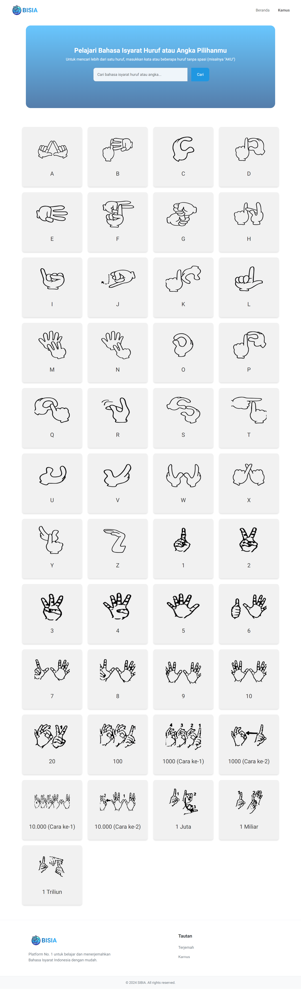

# BISIA Application

## Project Objective
The **BISIA Application** aims to create an interactive platform to help users, especially the deaf, learn **Indonesian Sign Language (BISINDO)**. The primary feature of the application is real-time hand gesture detection using the device’s camera, allowing users to practice and receive feedback on their sign language skills.

---

## Main Features

### 1. Hand Gesture Detection Using Camera:
- **Interactive Learning**: 
  Users can use their device's camera to detect and analyze hand gestures while practicing sign language.
  
- **AI and Computer Vision**: 
  The system is powered by AI and computer vision technologies, ensuring real-time feedback on the accuracy of the user’s movements.
  
- **Real-Time Feedback**: 
  As users perform various signs, the application provides instant feedback to help them adjust their gestures for better accuracy.

### 2. BISIA Sign Language Learning Course:
- **Structured Courses**: 
  The application offers several courses that are divided into modules with varying levels of difficulty, helping users progress at their own pace.
  
- **Video Tutorials**: 
  Each module includes YouTube video tutorials, explained by experienced sign language instructors, to guide users through the learning process.
  
- **Quizzes and Assignments**: 
  At the end of each module, users will be able to test their understanding through quizzes and assignments that ensure they grasp the lessons.

### 3. Indonesian Sign Language Dictionary:
- A comprehensive dictionary of **Indonesian Sign Language** terms is available, allowing users to look up and practice individual signs.

---

## Technologies Used
- **React.js**: Frontend framework for creating a responsive and dynamic user interface.
- **TensorFlow.js**: Used for real-time hand gesture detection using AI and machine learning models.
- **Bootstrap**: CSS framework for responsive design and mobile-first development.
- **Python (Backend)**: For AI model training and data processing.
- **YouTube API**: For integrating video tutorials.
- **WebRTC**: Enables real-time webcam access for gesture detection.

---

## Contribution

We welcome contributions from the community. If you would like to contribute to this project, please open a new issue or submit a pull request after making changes.

## License

This project is licensed under the MIT License. See the [LICENSE](./LICENSE) file for details.

## Contact

For further questions or technical support, please contact us at [falihrahmat534@gmail.com](mailto:falihrahmat534@gmail.com).

Visit our website: [BISIA App]( )

